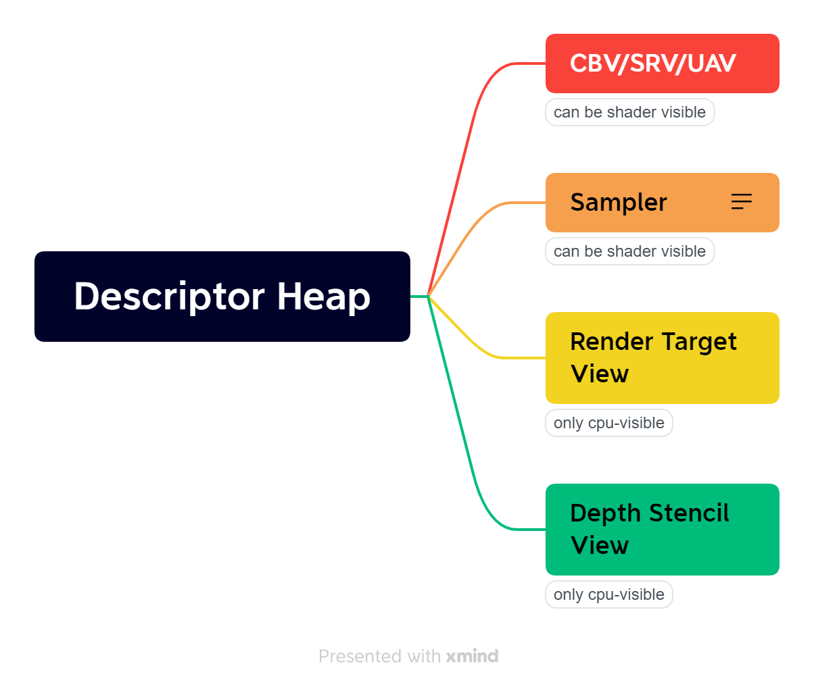

# CDX12
DX12 C++ Wrapper

---

* *部分设计参考了[Ubpa/UDX12](https://github.com/Ubpa/UDX12)*

* *Descriptor Heap设计参考了   [DiligentGraphcis_Managing_Descriptor_Heap](http://diligentgraphics.com/diligent-engine/architecture/d3d12/managing-descriptor-heaps/)*

---

## Set up

* *C++20*
* *MSVC/Clang*
* *DirectXTK12* 
