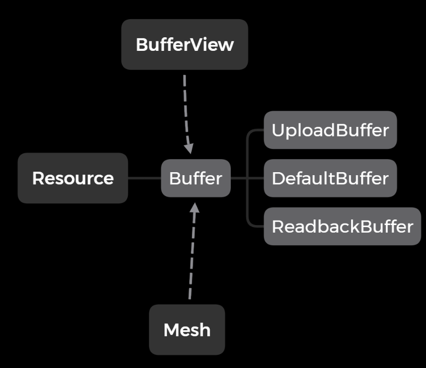

# Resource 

## Resource 封装

***参考自麦老师的 `dx12-tutorial`***



`Resource` 是所有资源的基类, `Buffer` 继承自 `Resource`, 本质上是一段 `GPU` 上的线性资源(类似 `std::vector<std::byte>`), 我们知道在 `dx12` 中又分为三种 `buffer`：
* `DefaultBuffer` : 仅供 `GPU` 读取
* `UploadBuffer` : 给 `Shader` 直接读取或写入, 可以从 `CPU` 端上传
* `ReadbackBuffer` : 给 `Shader` 直接读取或写入, 可以回读到 `CPU` 端
除此之外, 提供一个 `BufferView` 来标记 `Buffer`; `Mesh` 将会持有一个或多个 `buffer` 并记录 `Layout` ，`Buffer` 直接在 `ID3D12GraphicsCommandList::IASetVertexBuffers` 函数中提交到渲染管线，而 `Layout` 则辅助 `Device` 生成 `PSO` 

```cpp
// Vertex sample
struct Vertex : public rtti::Struct {
	rtti::Var<XMFLOAT3> position = "POSITION";
	rtti::Var<XMFLOAT3> normal = "NORMAL";
	rtti::Var<XMFLOAT2> tex_coord = "TEXCOORD";
};
```

`Vertex` 结构体中实际数据如下初始化:
```cpp
static Vertex vertex_sample;

std::vector<uint8_t> vertex_data(vertex_sample.structSize * 3);
uint8_t* vertex_data_ptr = vertex_data.data();

// vertex 0
vertex_sample.position.Get(vertex_data_ptr) = {.......};
vertex_sample.normal.Get(vertex_data_ptr) = {.......};
vertex_sample.tex_coord.Get(vertex_data_ptr) = {.......};
vertex_data_ptr += vertex_sample.structSize;

// vertex 1
vertex_sample.position.Get(vertex_data_ptr) = {.......};
vertex_sample.normal.Get(vertex_data_ptr) = {.......};
vertex_sample.tex_coord.Get(vertex_data_ptr) = {.......};
vertex_data_ptr += vertex_sample.structSize;

// vertex 2
vertex_sample.position.Get(vertex_data_ptr) = {.......};
vertex_sample.normal.Get(vertex_data_ptr) = {.......};
vertex_sample.tex_coord.Get(vertex_data_ptr) = {.......};
```

## ResourceState

`ResourceState` 最大的意义在于标记一个同步点, 使得相互依赖的GPU任务保持串行.