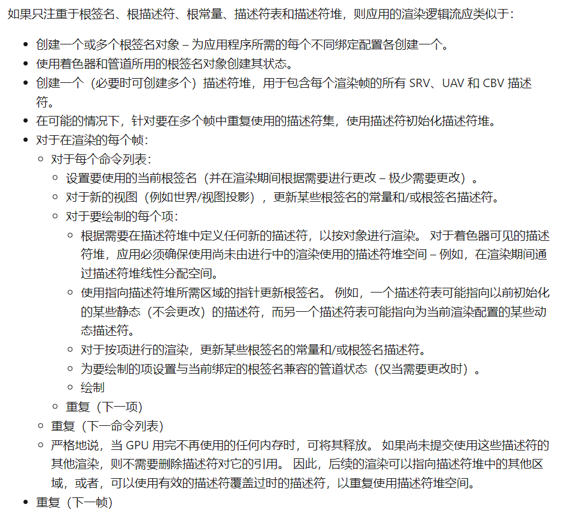
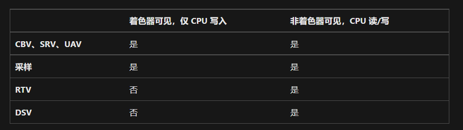
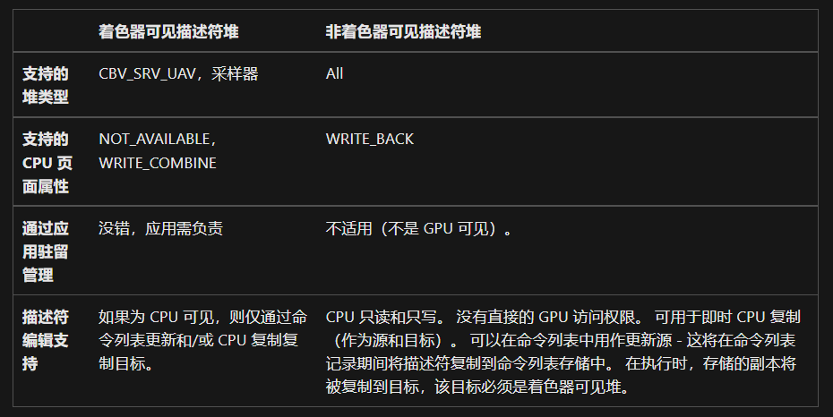

# Resource Binding

*绑定是将资源对象链接到图形管道着色器的过程*

---

描述符组合在一起构成了描述符表。每个描述符表存储有关一个资源类型范围的信息。有多种不同类型的资源。最常见的资源为：
* CBV
* SRV
* UAV
* Sampler

描述符表存储在描述符堆中。在理想情况下，描述符堆包含要渲染的一个或多个帧的所有描述符（在描述符表中）。所有资源将存储在用户模式堆中。

---

## Resource Type
* Texture1D, Texture1DArray
* Texture2D, Texture2DArray, Texture2DMS, Texture2DMSArray
* Texture3D
* 缓冲区（类型化、结构化和原始）

## Resource View (只有前四个是 Shader Visible)
* 常量缓冲区视图 (CBV) 
* 无序访问视图   (UAV)  
* 着色器资源视图 (SRV) 
* 采样器           
* 渲染器目标视图 (RTV)
* 深度模板视图   (DSV)
* 索引缓冲区视图 (IBV)
* 顶点缓冲区视图 (VBV)
* 流输出视图     (SOV)
  
## Possible rendering processes

其他描述符类型、渲染器目标视图 (RTV)、深度模板视图 (DSV)、索引缓冲区视图 (IBV)、顶点缓冲区视图 (VBV) 和着色器对象视图 (SOV) 以不同的方式进行管理.

---

# Descriptor

描述符是一个相对较小的数据块，它完全描述 GPU 的对象，采用特定于 GPU 的不透明格式. 
无需释放对象描述符。 驱动程序不会为描述符创建附加任何分配。 但是，描述符可能会对应用程序永久拥有的其他分配的引用进行编码. 
使用描述符的主要方法是将它们放置在描述符堆中，这些描述符堆是描述符的后备内存.

*描述符句柄是描述符的唯一地址, 句柄在描述符堆中唯一*

***Handle***
* CPUHandle : CPU handles are for immediate use, such as copying where both the source and destination need to be identified. Immediately after use (for example, a call to ID3D12GraphicsCommandList::OMSetRenderTargets), they can be reused, or their underlying heap can be disposed.
* GPUHandle : GPU handles are not for immediate use—they identify locations from a command list, for use at GPU execution time. They must be preserved until any command lists referencing them have executed entirely.

---

## 创建描述符
Fill the xxx_BUFFER_VIEW_DESC, then use it to create a Descriptor.

*对于 CBV_SRV_UAV, 虽然其在使用时必须是着色器可见的，但是由于 GPU端描述符堆的大小是存在限制的。因此在着色器资源等数量非常多时，可以先将其统一创建(暂存)在 CPU DescriptorHeap 中，需要使用时再把请求的资源拷贝到 GPU DescriptorHeap 中去.*

* 索引缓冲区视图 (IBV) 、顶点缓冲区视图 (VBV) ，将流输出视图 (SOV) 直接传递到 API 方法，没有特定的堆类型
  

---

# Descriptor Table

每个描述符表存储一个或多个类型的描述符-SRV、UAV、CBV 和采样器。 描述符表不是内存分配;它只是描述符堆的偏移量和长度。(类似 std::span)

图形管道通过根签名通过引用描述符表（按索引）获取对资源的访问。

描述符表实际上只是描述符堆的子范围。 描述符堆表示一批描述符的基础内存分配。 由于内存分配是创建描述符堆的属性，因此可以保证定义一个描述符表，这与将堆中的区域标识到硬件一样便宜。 不需要在 API 级别创建或销毁描述符表 - 系统仅会在堆被引用时向驱动程序将它们标识为堆的偏移量和大小。

当应用的着色器需要能够动态地（可能由材料数据驱动）从大量可用的描述符中自由进行选择（通常是引用纹理）时，应用则完全可以定义非常大的描述符表。

根签名可引用描述符表条目，其中包含对堆、表的起始位置（与堆的起始处的偏移量）以及表的长度（在条目中）的引用。
